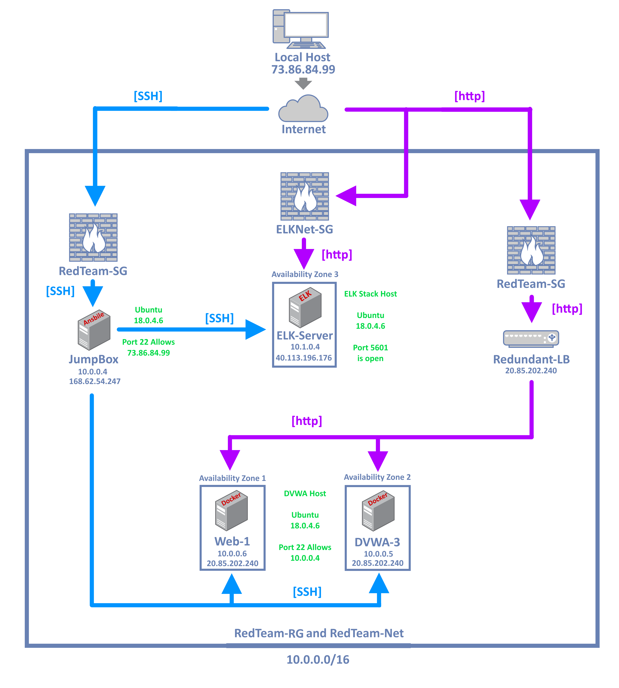

## Automated ELK Stack Deployment

The files in this repository were used to configure the network depicted below.

These files have been tested and used to generate a live ELK deployment on Azure. They can be used to either recreate the entire deployment pictured above. Alternatively, select portions of the playbook file may be used to install only certain pieces of it, such as Filebeat.

install-elk.yml
filebeat-playbook.yml
metricbeat-playbook.yml

This document contains the following details:
- Description of the Topology
- Access Policies
- ELK Configuration
  - Beats in Use
  - Machines Being Monitored
- How to Use the Ansible Build

### Description of the Topology

The main purpose of this network is to expose a load-balanced and monitored instance of DVWA, the D*mn Vulnerable Web Application.

Load balancing ensures that the application will be highly redundant, in addition to restricting access to the network.

Load balancers are put in place to protect the availability of the network by distributing traffic across more than one server. Their primary purpose is to ensure that if a host server goes down there are other servers to take its place. 

A jumpbox is a useful layer of extra security. It makes it extremely difficult for a malicious actor to access the network without knowing the whitelisted IP's allowed on the jumpbox. Access to the machines beyond the jumpbox is therefore much more secure.

Integrating an ELK server allows users to easily monitor the vulnerable VMs for changes to the metrics and system files.

Filebeat monitors changes in the system logs and collects log events, whereas Metricbeat records the usage of a systems hardware and services.

The configuration details of each machine may be found below.

| Name       | Function         | IP Address | Operating System 
|------------|------------------|------------|------------------
| Jump Box   | Gateway          | 10.0.0.4   | Linux/Ubuntu     
| Web-1      | Docker Container | 10.0.0.6   | Linux/Ubuntu     
| DVWA-3     | Docker Container | 10.0.0.5   | Linux/Ubuntu     
| ELK-Server | ELK Stack Host   | 10.1.0.4   | Linux/Ubuntu     

### Access Policies

The machines on the internal network are not exposed to the public Internet. 

Only the Jumpbox machine can accept connections from the Internet. Access to this machine is only allowed from the following IP addresses:

73.86.84.99

Machines within the network can only be accessed by the Jumpbox Ansible container

The ELK-Server can also be accessed publicly @40.113.196.176 with a valid ssh key or through the Ansible container @10.1.0.4

A summary of the access policies in place can be found in the table below.

| Name      | Publicly Accessible | Allowed IP Addresses |
|-----------|---------------------|----------------------|
| Jump Box  | Yes, whitelist only | 73.86.84.99          |
| Web-1     | No                  | 10.0.0.4             |
| DVWA-3    | No                  | 10.0.0.4             |
| ELK-Stack | No                  | 10.0.0.4             |

### Elk Configuration

Ansible was used to automate configuration of the ELK machine. No configuration was performed manually, which is advantageous because...

Automated configuration allows for easy recreation or iteration of existing machines, in other words, existing machines can be reset and new machines can be set up through playbooks.

The playbook implements the following tasks:
- Install the latest version of docker.io and enable it
- Install the latest version of python3-pip and enable it
- Increase the VMs available memory and restart
- Download and start the ELK Container and open the designated
  ports

The following screenshot displays the result of running `docker ps` after successfully configuring the ELK instance.

### Target Machines & Beats
This ELK server is configured to monitor the following machines:

Web-1 @10.0.0.6
DVWA-3 @10.0.0.5

We have installed the following Beats on these machines:
Filebeat and Metricbeat, both version 7.4.0

These Beats allow us to collect the following information from each machine:

Filebeat will allow us to track changes in the system logs as well as log events themselves. This can be useful in monitoring ssh requests into our server.

Metricbeat monitors a systems hardware usage which can alert us to suspicious activity in terms of network usage or CPU usage.

### Using the Playbook
In order to use the playbook, you will need to have an Ansible control node already configured. Assuming you have such a control node provisioned: 

SSH into the control node and follow the steps below:
- Copy the filebeat-config/metricbeat-config file to your
  desired set up folder (/etc/ansible/).
- Update the config file to include the private IP address of
  your ELK stack host server 
- Run the playbook, and navigate to your servers public IP:5601
  to check that the installation worked as expected.

_TODO: Answer the following questions to fill in the blanks:_
- install-elk.yml, filebeat-playbook.yml, and metricbeat
  -playbook.yml are the required playbooks
- To tell the playbook which machines you'd like to target update the hosts file with separate group names of your choice and append the correct IPs. In our case we used [webservers] and [elk]. Then specify the desired group in your .yml playbook
- The public IP of your ELK server at port 5601. ie 40.113.196.176:5601
